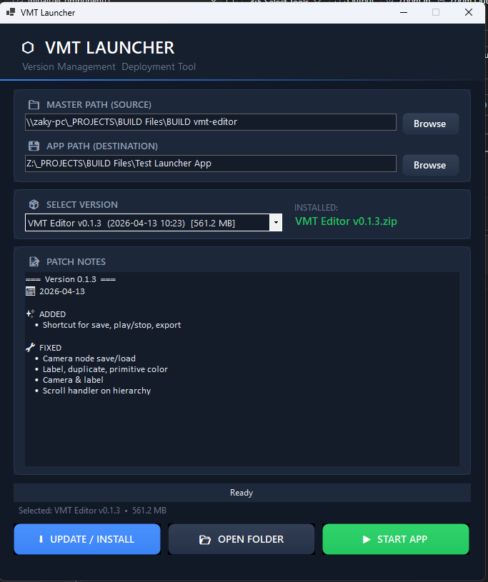

# VMT Launcher

VMT Launcher is a custom-built Game Launcher application developed in C# WinForms (.NET 10) designed for streamlined version management and deployment, specifically for Unity-based projects. It facilitates weekly updates over a local network (LAN) or shared folders.



## ✨ Features

- **Custom Premium UI**: A clean, minimalist dark navy blue theme with custom-painted controls for a professional feel.
- **Smart Versioning**: Automatically scans for version releases in `.zip` format from a Master (Server) path.
- **Structured Patch Notes**: Parses `versions.json` to display categorized changes with icons (Added, Fixed, Updated, Removed).
- **Process Safety**: Prevents updates while the game is running to avoid "Access Denied" errors.
- **Safety Backups**: Automatically creates backups of the `Managed` folder before every update.
- **User Data Preservation**: Automatically preserves user-generated data in `VMT Editor_Data\StreamingAssets\DataSave`, ensuring project/scenario saves are not lost during updates.
- **Async Operations**: Non-blocking UI during extraction with real-time progress reporting and cancellation support.
- **Persistent Settings**: Remembers Master and App paths across sessions.

## 📁 Architecture & Folder Structure

### Folder Structure
- **Master Path**: A shared folder/drive containing the deployment packages.
  - `VMT_Editor_v[Version].zip`
  - `versions.json` (Structured patch notes for all versions)
- **App Path**: The local installation folder on the user's PC.
  - `VMT_Editor.exe` (Main application)
  - `version.txt` (Identifier of the currently installed version)

### Structured Patch Notes (`versions.json`)
The launcher reads patch notes from a central JSON file in the Master Path:
```json
{
  "versions": [
    {
      "version": "0.1.3",
      "date": "2026-04-13",
      "changes": [
        { "type": "fixed", "value": "Camera node save/load" },
        { "type": "added", "value": "Shortcut for save, play/stop, export" }
      ]
    }
  ]
}
```

## 🚀 How to Use

1. **Configure Paths**:
   - Provide the **Master Path** (where the `.zip` updates are stored).
   - Provide the **App Path** (where your game is installed).
2. **Select Version**: Choose the desired version from the dropdown menu (sorted by newest).
3. **Update**: Click **Update / Install** to extract and install. The launcher will:
   - Check if the app is running.
   - **Preserve User Data**: Backup contents of `DataSave` folder.
   - Backup the existing `Managed` folder.
   - Overwrite local files with the new package.
   - **Restore User Data**: Restore `DataSave` files back into the installation.
   - Update the local `version.txt`.
4. **Launch**: Click **Start App** to play!

## 🛠️ Development Requirements

- **Framework**: .NET 10.0+ (Windows Forms)
- **Language**: C# 13.0+
- **Platform**: Windows

## 🎨 Theme Details
- **Primary Background**: `#121926`
- **Accent Blue**: `#3B82F6`
- **Accent Green**: `#22C55E`
- **Typography**: Segoe UI / Cascadia Code (Patch Notes)
